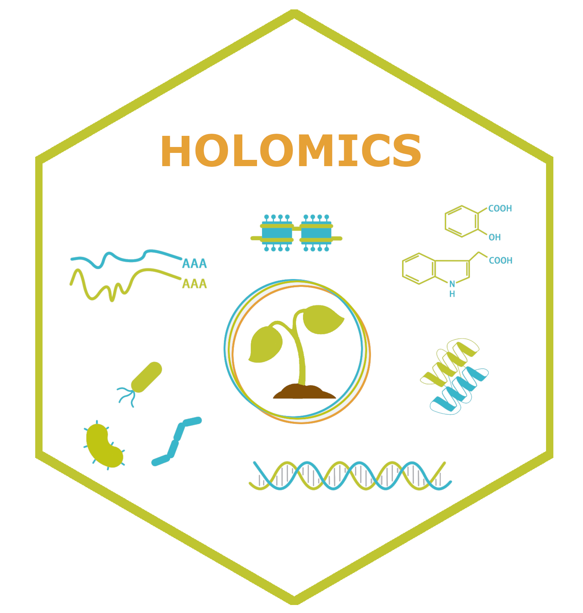
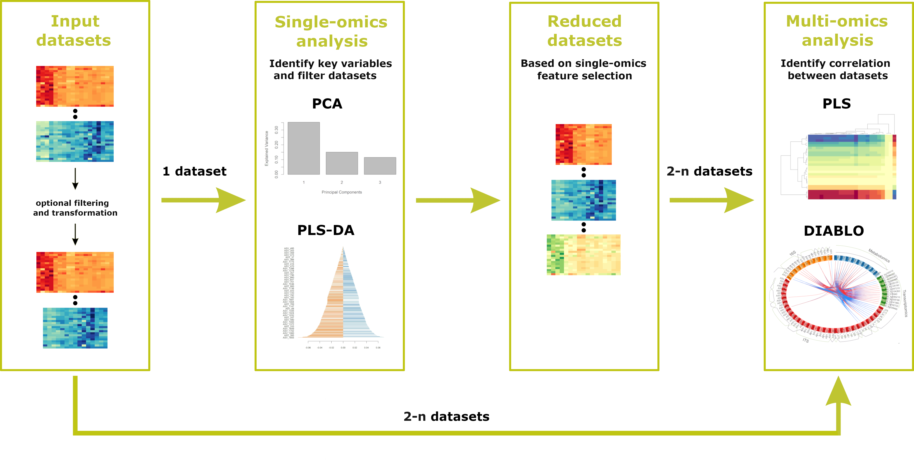

<!-- README.md is generated from README.Rmd. Please edit that file -->

# Holomics

<b>Holomics</b> is an R Shiny application enabling its users to perform
single- and multi-omics analyses by providing a user-friendly interface
to upload the different omics datasets, select and run the implemented
algorithms and finally visualize the generated results.

<b>Holomics</b> is mainly built on the R package mixOmics, which offers
numerous algorithms for the integrative analysis of omics datasets. From
this repertoire, the single-omics algorithms “Principle Component
Analysis” (PCA) and “Partial Least Squares Discriminant Analysis”
(PLS-DA), the pairwise-omics analysis “sparse Partial Least Squares”
(sPLS) and the multi-omics framework DIABLO (“Data Integration Analysis
for Biomarker discovery using Latent variable approaches for Omics
studies”) have been implemented in <b>Holomics</b>.

## Installation

For the current Holomics version it is very important that you use R
4.2. and check that mixOmics was installed with version 6.22.0. \###
CRAN \~\~~ install.packages(“Holomics”) \~\~~

### Github

    # Install devtools if it is not already installed
    install.packages("devtools")
    library(devtools)

    # Install Holomics package 
    install_github("https://github.com/MolinLab/Holomics")

### Additional packages

You need to install the Bioconductor package separately.

    if (!require("BiocManager", quietly = TRUE))
        install.packages("BiocManager")
    BiocManager::install("mixOmics", version = "6.22.0")
    BiocManager::install("BiocParallel")

## Start application

Either with

    library(Holomics)
    run_app()

or

    Holomics::run_app()

## Workflow

To use all the features offered, the workflow described below should be
followed. First, the datasets are uploaded where any
pre-filtering/transformation step takes place. Then the user should take
the datasets to the single-omics analysis, where key features are
identified and the datasets are reduced accordingly. After the
single-omics analyses, the user can apply the multi-omics analyses to
identify correlations between 2-n datasets. NOTE: If pre-filtered
(ideally from Holomics at an earlier stage) datasets have already been
uploaded, it is possible to start directly with the multi-omics
analysis.

## Further information

For further information on how to use Holomics please have a look at our
vignette.
