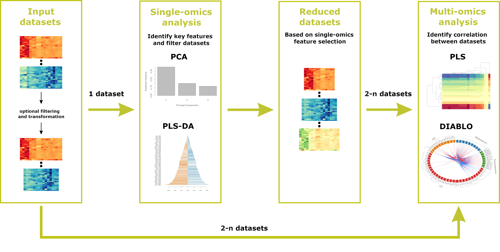

# Welcome to Holomics
Holomics is an R Shiny application that allows its users to perform single- and multi-omics analyses by providing a user-friendly interface to upload the different omics datasets and select and run the integrated algorithms. Holomics is mainly built on the R package <a class='mixOmics-link' href="http://mixomics.org/" rel="noreferrer noopener" target="_blank">mixOmics</a>. The app takes the input files, passes them to the mixOmics algorithms and presents the resulting graphs and tables to the user.  
mixOmics provides numerous analysis algorithms for the integrative analysis of omics datasets. The two single-omics algorithms "Principle Component Analysis" (PCA) and "Partial Least Squares Discriminant Analysis" (PLS-DA), the pairwise-omics analysis "sparse Partial Least Squares" (sPLS) and the multi-omics framework DIABLO ("Data Integration Analysis for Biomarker discovery using Latent variable approaches for Omics studies") have been implemented in Holomics so far.

Below we provide a short summary of the functionalities Holomics provides and the recommended workflow that should be followed when using Holomics. Additionally, we suggest to have a look at our <a class='mixOmics-link' href="https://cran.r-project.org/web/packages/Holomics/vignettes/Holomics.html" rel="noreferrer noopener" target="_blank">vignette</a>, where describe every aspect of Holomics in more detail.

### Functionality overview

<ul>
  <li>Perform single-omics analyses and get an overview over your data</li>
  <li>Reduce datasets by their key features</li>
  <li>Perform multi-omics analyses and identify correlations between the datasets</li>
  <li>Save (most) result plots as images in print quality</li>
</ul>

### Workflow
To make use of all the functionality provided by Holomics, a certain workflow should be followed.

Input datasets: 
 The needed datasets for the analyses have to be uploaded via the "Data upload" page. These datasets include the collected omics data itself (e.g. count tables) and a separate file containing the allocated classes (meta information) of the samples measured in the omics datasets. The uploaded omics datasets will optionally be pre-filtered/transformed before they can be used for the different analyses.  

Single-omics analyses: 
 With the single-omics analyses you can get a first impression of your data. You can identify the key features and reduce your dataset accordingly.    

Reduced datasets: 
 Using the single-omics algorithms you can let the dataset get reduced automatically by the results of the used analysis. The reduced data will be directly saved in the Holomics application and can be used in the multi-omics analyses. Additionally, you will get the reduced data provided as an .xlsx file.   
As an alternative you can directly go into the multi-omics analyses if you already uploaded pre-filtered datasets and do not want to reduce them any further.  

Multi-omics analyses: 
 With the multi-omics analyses you are finally able to identify potential correlations between your datasets.  
