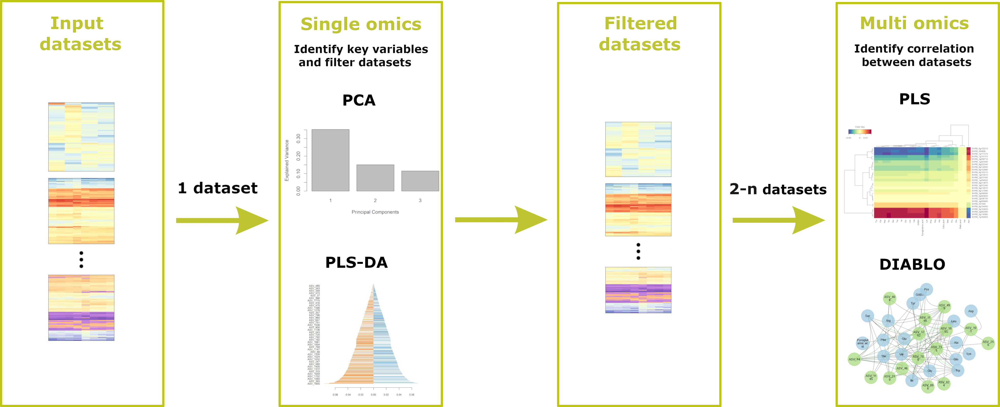

# Welcome to Holomics

Holomics is a web application, which allows you to perform single- and multi-omics analyses.  
The used analyses algorithms are based on the <a class='mixOmics-link' href="http://mixomics.org/" rel="noreferrer noopener" target="_blank">mixOmics</a> package.

### Functionality overview

<ul>
  <li>Perform single-omics analyses and get an overview over your data</li>
  <li>Filter datasets by their key variables</li>
  <li>Perform multi-omics analyses and identify correlations between the datasets</li>
  <li>Save (most) result plots as images in print quality</li>
</ul>

### Workflow
To make use of all the functionality provided by Holomics, a certain workflow should be followed.

Input datasets: 
 The needed datasets for the analyses have to be uploaded via the "Data upload" page. These datasets include the collected omics data itself (e.g. count tables) and a separate file(s) containing the allocated classes of the samples in the omics data.  

Single-omics analyses: 
 With the single-omics analyses you can get a first impression of your data. You can identify the key variables of your data and filter accordingly.    

Filtered datasets: 
 With the single-omics algorithm PLS-DA you have the opportunity to automatically filter your data by the results of the analysis. The filtered data will be directly saved in the Holomics application and can be used in the multi-omics analyses. Additionally, you will get the filtered data provided as an excel file.   
As an alternative you can directly go into the multi-omics analyses if you already uploaded pre-filtered datasets and do not want to filter them any further.  

Multi-omics analyses: 
 With the multi-omics analyses you are finally able to identify potential correlations between your datasets  

### About

Holomics has been developed at the Austrian Institute of Technology as part of the <a href="https://metabolomics-ifa.boku.ac.at/OMICS40Project/" rel="noreferrer noopener" target="_blank" style="color: var(--green)"> Omics 4.0 project</a>.
