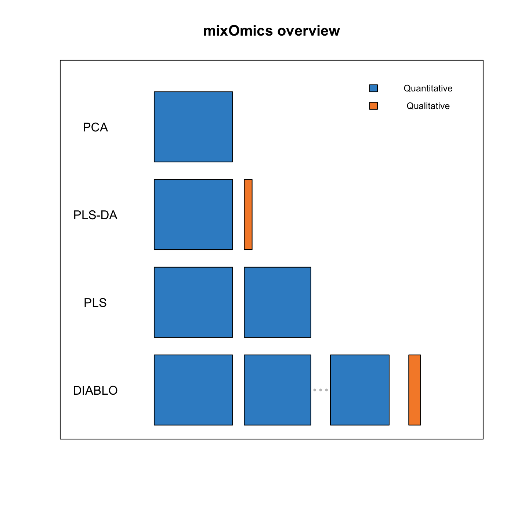

# Welcome to Holomics

<!-- badges: start -->

[](https://lifecycle.r-lib.org/articles/stages.html#experimental)
<!-- badges: end -->

The goal of Holomics is to ease the process of interpretation and integration of transcriptomic, metabolomic and metagenomic plant data.
Most methods are based on the mixOmics package.
A demo version is hosted on shinyapps.io https://z3nqcf-hirun.shinyapps.io/holomics/

## Installation

You can install the development version of Holomics

``` r
install.packages("devtools")
devtools::install_github("Hirun/Holomics")
```

## Overview Methods

The following methods are being implemented at the moment.





## About Holomics

Holomics has been developed at the Austrian Institute of Technology as part of the Omics 4.0 project.


