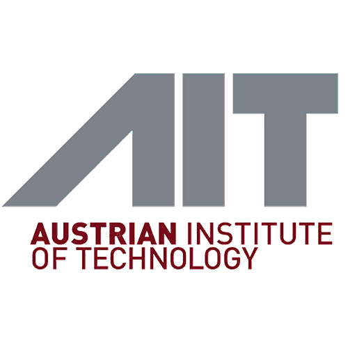
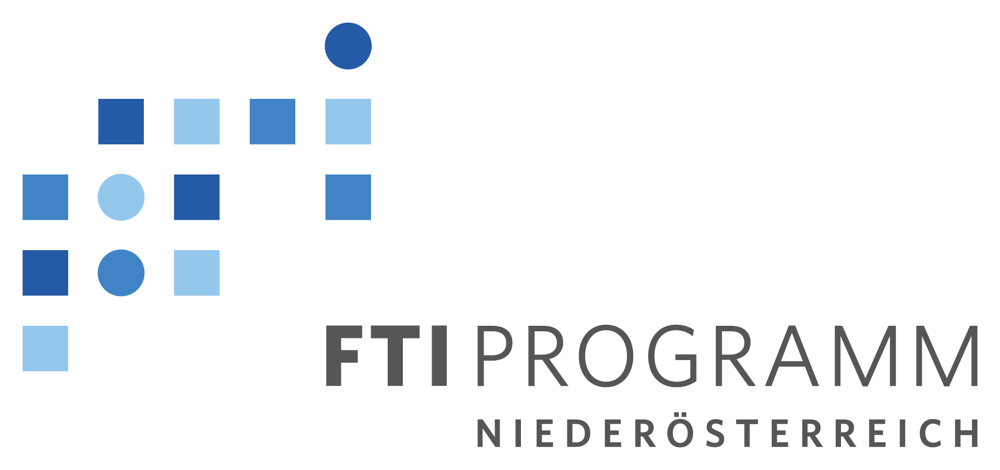

# Team
Holomics was developed by Katharina Munk and Eva M. Molin. Additionally, Günter Brader contributed by giving feedback during the development process.

# How to cite
Munk, K., Tucek, L., Brader, G. & Molin, E.M. (2023). Holomics - an user-friendly R Shiny application for multi-omics data integration and analysis (to be published) 
R package version 1.0.0. https://CRAN.R-project.org/package=Holomics
# License
The Holomics package is distributed under GPL-3 (GNU GENERAL PUBLIC LICENSE version 3).

# Acknowledgement
Holomics has been developed at the <a class='mixOmics-link' href="https://www.ait.ac.at/" rel="noreferrer noopener" target="_blank">AIT - Austrian Institute of Technology</a> within the research project <a class='mixOmics-link' href="https://metabolomics-ifa.boku.ac.at/omics40project/" rel="noreferrer noopener" target="_blank">OMICs 4.0</a>, which is funded by the Federal State of Lower Austria as part of the FTI-Strategy Lower Austria.

