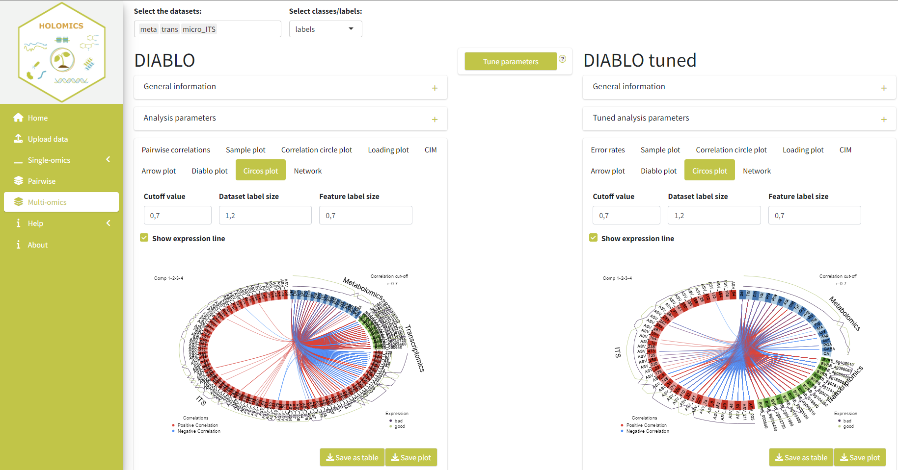

```{r, include = FALSE}
knitr::opts_chunk$set(
  collapse = TRUE,
  comment = "#>",
  echo = F,
  fig.align='center', 
  fig.pos= "h"
)
```

<style>
  :root {
    --grey: #f1f3f2;
    --green: #bfc531;
    --blue: #39B6CA;
    --orange: #e6a136;
  }  
         
  h1, h2, h3 {
    color: var(--green);
  }
  
  .list-group-item.active, .list-group-item.active:focus, .list-group-item.active:hover {
      background-color: var(--green);
  }
  .active {
    background-color: var(--green);
  }


</style>

## Introduction
Holomics is a R Shiny application, which enables its users to perform single- and multi-omics analyses. Therefore, Holomics provides a user-friendly interface to upload the different datasets, choose and perform the various analyses and then presents the results to the user. To perform the various analyses Holomics uses the R package mixOmics [@rohart2017mixomics]. This means Holomics takes the input files, forwards them to the mixOmics algorithms and takes the resulting plots/tables and presents them to user. 

mixOmics provides numerous analyses algorithms, but Holomics only integrates the two single-omics algorithms "Principle Component Analysis (PCA)" and "Partial Least Squares Discriminant Analysis (PLS-DA)", one pairwise omics analysis called "sparse Partial Least Squares (sPLS)" and one multi-omics analysis called "Data Integration Analysis for Biomarker discovery using Latent variable approaches for Omics studies (DIABLO)".


## Getting started
### Installation
### Data preparation
To be able to use Holomics there are at least two input files needed. On one side the dataset(s) with the measured values of the omes that need to be analysed and on the other side a file with the labels/classes information associated to the 

#### Omics data
The omics dataset has to be a numeric matrix in an excel or csv file, whereas the rows have to be the samples and the columns the measured features.
The first column has to contain the sample names and the first row the features names.
If the data contains more variables/columns then excel allows the matrix can be saved in the transposed format.
Additionally, if the dataset contains more than 10.000 features, Holomics will pre-filter the dataset to 10.000 or less features as mixOmics suggests to use their package with max. 10.000 features [@le2023mixomics]. If this is not wanted the dataset needs to be split into multiple files, separately pre-filtered and the merged together manually. 
In addition any wanted/necessary normalisation needs to be done before using Holomics.

Table \@ref(tab:omicsData) shows an example of a valid, but very small, omics dataset. Other valid datasets need to have the same format, which means only the number of rows/columns, the row and column names and the values themselves can be changed.

Table:  (\#tab:omicsData) Example of a valid omics dataset.
```{r message=F}
data <- as.data.frame(readxl::read_excel("data/asv_small.xlsx", col_names = T))
rownames(data) <- data[, 1]   #all rows, first column
data <- data[,-1]
knitr::kable(data)
```


#### Labels/classes file
The labels/classes file has to be an excel or csv file with at least two columns.
The first column contains the sample names, which have to be exactly the same as in the associated omics datasets.
The second columns contains the classes of the samples (e.g. bad, good, ...). The column name of the second column has to be the name of the attribute the classes describe (e.g. Storability, Quality, ...).
Additionally, in a third column, a color name / hex code per class can be added, which will be used in the plots. The column name of this column has to be either 'Color' or 'Colorcodes'.

Table \@ref(tab:labels) shows an example of a valid labels/classes file associated to the dataset in Table \@ref(tab:omicsData). Column one and two are mandatory, only column three can be omitted. Important is also that the order of the samples has to be the same as in the associated dataset.

Table:  (\#tab:labels) Example of a valid labels/classes file.
```{r message=F}
data <- as.data.frame(readxl::read_excel("data/labels.xlsx", col_names = T))
knitr::kable(data)
```

## Workflow
To make use of all the functionality provided, the below described workflow should be followed. Firstly, the user needs to upload the datasets to be able to use them for the (single) omics analysis. Afterwards, the user should go with the datasets into the single-omics analysis, where key variables are identified and the datasets are filtered accordingly. After the single-omics analyses, the user can apply the multi-omics analyses to identify correlations between 2-n datasets. NOTE: If the user already uploaded pre-filtered (ideally by Holomics at an earlier time) datasets, it is possible to go directly into the multi-omics analysis. 

```{r workflow, fig.cap = "Holomics workflow", out.width="100%"}
knitr::include_graphics("images/workflow.png")
```


## Upload
On the upload page the user can upload the omics datasets and the related metadata (including sample names and labels). On both sub-pages, the user can find on the top of the page a collapsible "General information" box, which contains some information on how the different input files should look like. Additionally, next to some form fields question marks indicate a tooltip that should help the user to better understand the meaning of the different fields.

### Upload omics dataset
To upload an omics dataset from a previous omics project (e.g. transcriptomics read count table, metabolimics table, etc.) the user has to select "Omics data" as the data type. Afterwards, the wanted .xlsx or .csv file has to be selected via the file upload and a file name must be entered, which will be used on the analyses pages to identify that dataset easily. Also, the user has to check whether the dataset was already filtered at an earlier time point (through Holomics) or not. If the dataset is coming from microbial community analyses (e.g. if it is an ASV table), additionally, it is important to check the "contains microbiome data" checkbox, so that a necessary preprocessing step especially for microbiome datasets will be triggered. If the dataset has a transposed format (so the samples are columns instead of the rows and the features the rows instead of the columns) the user needs to check the "has transposed format" checkbox, as Holomics needs to transpose it internally to the correct format.

Next, the user needs to select for which analyses the dataset(s) should be used, whereas the datasets can only be used for multi-omics analyses if the "was previously filtered" checkbox is checked. 

Lastly, the name which should be used in the plots for this dataset can be selected or entered by the user. Be aware that the file name from before and the "plot name" here do not need to be the same and that the "plot name" can be the same for multiple datasets.

After filling in the upload form the user can click save and the dataset will be saved in the Holomics application and a summary of the uploaded information will be added to the table on the right side of the page.

Figure \@ref(fig:uploadData) shows on the right side the summary of an already uploaded dataset and on the left side the filled-in form with a new dataset before saving it.
```{r uploadData, fig.cap = "Upload page - omics data", out.width="100%"}
knitr::include_graphics("images/Upload_data.png")
```

### Upload metadata file
To upload the metadata file with the labels/classes of the samples of the different datasets the user has to select "Labels/Classes" as the data type. Then again a .xlsx or .csv file has to be selected, which contains the sample names and the associated labels. Additionally, a name for the file itself must be entered, which will also be used on the analysis pages to differentiate between the different upload files. Lastly, the user has to select whether the uploaded file also contains a column containing color codes (HEX or ASCII names) per sample added to the columns with the sample name and the label/class. This color-scheme is then used in most of the plots to depict the distinct classes.

After filling in the upload form the user can click save and the labels file will be saved in the Holomics application and a summary of the uploaded information will be added to the table on the right side of the page.

Figure \@ref(fig:uploadClasses) shows on the right side the summary of an already uploaded labels file and on the left side the form to upload a new/additional file.
```{r uploadClasses, fig.cap = "Upload page - labels/classes", out.width="100%"}
knitr::include_graphics("images/Upload_labels.png")
```

## Principle Component Analysis
The Principle Component Analysis (PCA) can be used to analyse single omics datasets. On the top left of the page via the drop-down menus, the user can select the omics dataset that should be analysed and the corresponding metadata file. If the two are not compatible to each other, an error will be printed to inform the user.

Below the data selection input is the "General information" box, which shortly explains the PCA concepts and provides some links to additional knowledge sources. Then there is the "Analysis parameters" box, where the user can choose the number of components (value between 2 and 15) that should be used to calculate the PCA result and if the dataset should be scaled or not. By default, the dataset will always get scaled. 

The rest of the page's left side shows the different plots that present the PCA result using the above set parameters.

On the right side, the general structure is the same as on the left side, with the big difference that results from the filtered dataset are shown. To trigger the filtering process the user has to click the "Filter dataset" button at the top-middle of the page. Now it will be calculated how many components are needed for the given dataset to get at least 80\% explained variance. When this number is set, the algorithm determines how many features per component should be used so that the resulting model gives the best result. All the remaining features that are not being used in any component will be removed from the dataset (the original dataset will not be changed) and the filtered dataset will be used to calculate the PCA result used for the plots. So on the right side, the plots represent the filtered dataset and the "General information" and "Filtered dataset parameters" box above the plots provide some additional information about the filtered dataset and the general filtering process. Here the components and scaling attribute cannot be changed.

Additionally, the user can download the filtered dataset as a .xlsx file by clicking the button "Save filtered data", which will appear below the "Filter dataset" button after the filtering process has finished. Also, the filtered dataset will automatically be saved in the running Holomics application and can be used for multi-omics analyses.

Generally, it is essential to know that if the filtering process calculates that the PCA needs more than 15 components to reach the minimum of 80% the filtering process will be aborted, as the calculation would take way too long. It is then recommended to use the PLS-DA function for filtering the dataset instead. 

Figure \@ref(fig:PCA) shows the PCA page with a test dataset.
```{r PCA, fig.cap = "PCA page", out.width="100%"}
knitr::include_graphics("images/PCA.png")
```

## Partial Least Squares Discriminant Analysis
The Partial Least Squares Discriminant Analysis (PLS-DA) can also be used to analyse single (omics) datasets, but in comparison to the PCA, PLS-DA is a supervised method including also the label/class information in its computation. 

Again on the top left of the page, the user can select the omics dataset that should be analysed and the corresponding label file. If the two are not compatible an error will be printed to inform the user.

Below the data selection input is again the "General information" box, which shortly explains the concepts of the PLS-DA and provides some links to additional knowledge sources. Below is the "Analysis parameters" box, where the number of components can be manipulated and whether the dataset should be scaled (default) or not. 

The resulting plots are again presented below the two boxes. The kind of plots is almost the same as the ones from the PCA analysis, only that the PLS-DA does not provide a scree plot.

In the middle of the page, the user can again click the "Filter dataset" button to start the filtering process and on the right side of the page, the results will be presented. Compared to the PCA filtering process, the number of components the user sets on the left side influences the filtering algorithm. The algorithm tries 1 to n (number of components set by user) components on the provided dataset and chooses the number where the error rate of the received model was the lowest. Additionally, the number of features per component is calculated and the dataset is filtered to keep only these features.

Once more on the right side, the information about the result of the PLS-DA with the filtered dataset and the plots will be presented. The components and the scaling attribute cannot be changed for these plots.

Additionally, the user can download the filtered dataset as a .xlsx file by clicking the button "Save filtered data", which will appear below the "Filter dataset" button after the filtering process has finished. Also, the filtered dataset will automatically be saved in the running Holomics application and can be used later for multi-omics analyses.

Figure \@ref(fig:PLSDA) shows the PLS-DA page with a test dataset.
```{r PLSDA, fig.cap = "PLSDA page", out.width="100%"}
knitr::include_graphics("images/PLSDA.png")
```

## Pairwise omics analysis
For the pairwise omics analysis (integration of two different omics datasets), the sparse Partial Least Squares (sPLS) method is applied. The structure of the page is the same as the one of the single-omics analysis pages. On the top, the user can select the two datasets and the corresponding labels file. On the left the user can find again some general information, the possibility to manipulate the analysis parameters and the resulting plots. 

Instead of the filter button, there is now a "Tune parameters" button in the middle of the page. When clicking the button the user starts the tuning process of the sPLS analysis. The tuning process is generally similar to the filtering process from before. It calculates the ideal number of components for the given datasets and the number of features per dataset. "Ideal" means the number of components and features per component, where the model, which is built in the background, has the lowest error rate. Like the filtering process of the PLS-DA, the tuning algorithm of the sPLS tests 1 to n (number of components set by the user on the left side) components and chooses one of these as the "ideal".

When the tuning process has finished a switch will appear under the "Tune parameters" button, which when switched on leads to the visualisation of the results on the right side of the page that use the tuned parameters. Same as with the single-omics pages the top two boxes provide some general information and the resulting tuned parameters and below the plots are shown.

Figure \@ref(fig:sPLS) shows the pairwise analysis / sPLS with two test datasets before (left side) and after the tuning process (right side).
```{r sPLS, fig.cap = "Pairwise analysis / sPLS page", out.width="100%"}
knitr::include_graphics("images/sPLS.png")
```

## Multi-omics analysis
The multi-omics analysis is done by applying the DIABLO framework, which can take two or more datasets (theoretically also only one) as its input and tries to find any correlations between the datasets. The structure of the page is the same as previously described. On the top, the user can select the datasets and the corresponding metadata file. On the left the user can find again some general information, the possibility to manipulate the analysis parameters and the resulting plots. Specifically, the user is able to manipulate the value of the design matrix used by the analysis in the "Analysis parameters" box. The design matrix indicates whether there are prior known or calculated correlations between the datasets, which should be taken into consideration when analysing the datasets. For now, Holomics only allows the user to set one correlation value over the entire matrix, which will be used for all pairwise correlations.

Like before for the sPLS analysis, in the middle of the page is the "Tune parameters" button, which triggers the tuning process. The tuning process works exactly like the one for sPLS (calculates the ideal number of components and the number of features per dataset).

When the tuning process has finished, again a switch will appear under the "Tune parameters" button, which when switched on leads to the visualisation of the results on the right side of the page that use the tuned parameters.

Figure \@ref(fig:DIABLO) shows the multi-omics analysis / DIABLO with three test datasets before (left side) and after the tuning process (right side).    
```{r DIABLO, fig.cap = "Multi-omics analysis / DIABLO page", out.width="100%"}

```

## Help pages
The help pages provide short descriptions of the used plot and the filtering and tuning processes. Additionally, there are several links to the mixOmics website or to multiple papers, where the user can get even more detailed information if desired.

## License
<!-- TODO -->

## Cite
<!-- TODO -->

## Session info
```{r, echo = FALSE}
sessionInfo()
```

## References