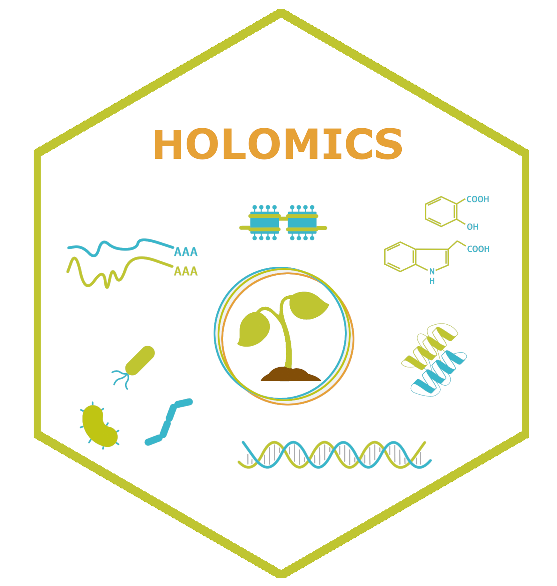

```{r, include = FALSE}
knitr::opts_chunk$set(
  collapse = TRUE,
  comment = "#>",
  echo = F,
  fig.align='center', 
  fig.pos= "h"
)
```


<style>
  :root {
    --grey: #f1f3f2;
    --green: #bfc531;
    --blue: #39B6CA;
    --orange: #e6a136;
  }  
         
  h1, h2, h3, a {
    color: var(--green);
  }
  
  .list-group-item.active, .list-group-item.active:focus, .list-group-item.active:hover {
      background-color: var(--green);
  }
  .active {
    background-color: var(--green);
  }
  
  .caption{
    color: #777;
    text-align: left;
  }
}
</style>

 

## Introduction
<b>Holomics</b> is an R Shiny application that allows its users to perform single- and multi-omics analyses by providing a user-friendly interface to upload the different omics datasets, select and run the implemented algorithms and finally visualize the generated results. 

<b>Holomics</b> is mainly built on the R package mixOmics [@rohart2017mixomics], which offers numerous algorithms for the integrative analysis of omics datasets. From this repertoire, the single-omics algorithms "Principal Component Analysis" (PCA) and "Partial Least Squares Discriminant Analysis" (PLS-DA), the pairwise-omics analysis "sparse Partial Least Squares" (sPLS) and the multi-omics framework DIABLO ("Data Integration Analysis for Biomarker discovery using Latent variable approaches for Omics studies") have been implemented in <b>Holomics</b>.


## Getting started
### Installation
For the current Holomics version it is very important that you use R 4.2. and check that mixOmics was installed with version 6.22.0.

#### CRAN
~~~
install.packages("Holomics")
~~~

#### Github
~~~
# Install devtools if it is not already installed
install.packages("devtools")
library(devtools)

# Install Holomics package 
install_github("MolinLab/Holomics")
~~~

#### Additional packages 
You need to install the Bioconductor package separately. 

~~~
if (!require("BiocManager", quietly = TRUE))
    install.packages("BiocManager")
BiocManager::install("mixOmics")
BiocManager::install("BiocParallel")
~~~

I could be that you need to install some Bioconductor packages separately. Just use the code snippet above.

### Start application
Within the Rstudio environment, start the application either with 

~~~
library(Holomics)
run_app()
~~~

or 

~~~
Holomics::run_app()
~~~

### Data preparation
<b>Holomics</b> requires two input file types: 
<ol>
  <li> the dataset(s) with the measured values of the performed omics analysis (e.g. transcriptomics, metabolomics)
  <li> a metadata file containing the label or class information associated to the samples
</ol>


#### Omics dataset
Omics datasets can contain molecular features measured on a continuous scale (e.g., microarray, mass spectrometry-based metabolomics) or sequence-based count data (e.g., RNA-seq, 16S rRNA amplicon sequencing), which become continuous after pre-processing and normalization. 

In general, the omics dataset must be a numeric matrix (essentially a count table) in either .xlsx, .csv or .txt format, where rows represent samples and columns represent measured features (see Table \@ref(tab:omicsData)).
The first column has to contain the sample names and the first row the feature names. There are no strict restrictions on the characters and symbols used in names, but it is recommended to minimize the use of special characters. 

<b>It is important that all omics datasets used together in an analysis share the same sample names and follow the same sample order.</b> 

If the dataset contains more features (columns) than Excel allows, the matrix can also be uploaded in transposed format.

Additionally, if an omics dataset contains more than 10,000 features, it will be pre-filtered to 10,000 or fewer features, as mixOmics can process a maximum of 10,000 features per dataset [@le2023mixomics]. 

Any desired or required normalization must be performed separately on each omics dataset before using <b>Holomics</b>. 

Table:  (\#tab:omicsData) Example of an omics dataset with sample names in the first column and feature names in the first row.
```{r message=F}
data <- as.data.frame(readxl::read_excel("data/asv_small.xlsx", col_names = T))
rownames(data) <- data[, 1]   #all rows, first column
data <- data[,-1]
knitr::kable(data)
```


#### Metadata file
The metadate file has to be in an .xlsx or .csv file format with at least two columns (see Table \@ref(tab:labels) for an example):

* The first column contains the sample names, which have to be exactly the same and in the <b>same order</b> as in the associated omics datasets.

* The second column contains the classes or labels of the samples (e.g. control, treatment1, ...). The column name of the second column has to be the name of the attribute the classes describe (e.g. Quality, Treatment, ...).

* Optional: in the third column, a color code (HEX code or ASCII name) per class can be added, which will be used later in most of the plots. Here a link to an easy to use <a href="https://htmlcolorcodes.com/"> Color picker</a>.

Table:  (\#tab:labels) Example of a valid metadata file with the mandatory first two columns (sample name and label information) and the optional column with the color codes.
```{r message=F}
data <- as.data.frame(readxl::read_excel("data/labels.xlsx", col_names = T))
knitr::kable(data)
```

## Workflow overview
To make use of all the functionality provided by <b>Holomics</b>, the workflow described below should be followed. First, datasets are uploaded, during which any necessary pre-filtering or transformation steps can be applied. Next, single-omics analysis is performed to identify key features and reduce the datasets accordingly. Using these reduced datasets, multi-omics analysis is then conducted to identify correlations between two or more datasets. 

<br>

(ref:workflow) Visualisation of the <b>Holomics</b> workflow, which goes from uploading the input datasets to performing single-omics analyses including feature selection and finally going into the multi-omics analyses. Alternatively, it is possible to go directly into the multi-omics analyses.

```{r workflow, fig.cap = "(ref:workflow)", out.width="100%"}
knitr::include_graphics("images/workflow.png")
```
<br>
<b>NOTE:</b> If pre-filtered datasets (ideally processed earlier using <b>Holomics</b>) are uploaded, the dataset reduction step can be skipped, and the workflow can proceed directly to the multi-omics analysis. This shortcut can also be used if the original, unfiltered datasets are to be used in the multi-omics analysis. In either case, the "Was previously filtered" checkbox must be selected to enable this route, effectively bypassing the reduction step.

## Data upload
On the data upload page the omics datasets (Figure \@ref(fig:uploadData)) and the related metadata (including sample names and labels, see Figure \@ref(fig:uploadClasses)) are uploaded. On both sub-pages, a collapsible "General information" box is given, which contains some information on how the different input files should look like. Additionally, next to some form fields question marks indicate a tooltip for a quick explanation.

### Upload an omics dataset
To upload an omics dataset (e.g., a transcriptomics read count table or a metabolomics table), the "Omics data" data type must be selected. 

Then the following fields need or can be filled:
<ul style="margin-bottom: 10px">
  <li><i>File upload:</i> Dataset as .xlsx,.csv or .txt file</li>
  <li><i>Separator:</i> Separator character that separates the data entries (in case of a xlsx file any separator can be selected)</li>
  <li><i>Data name:</i> Name for the dataset, which will be used inside the Holomics app to differentiate between the datasets</li>
  <li><i>Was previously filtered:</i> The dataset has already been filtered at an earlier stage (preferably using Holomics), the filtering steps will then be skipped</li>
  <li><i>Is microbiome data:</i> The dataset originates from microbial community analysis (e.g., an OTU/ASV table). If checked the mixMC pipeline for microbiome data [@le2016mixmc] will be triggered to preprocess the data.</li>
  <li><i>Has transposed format:</i> Samples in columns and features in rows</li>
  <li><i>Use for ... omics analysis:</i> Dataset can be used either for single- or multi-omics or both analysis. If "multi" is selected, then also "Was previously filterd" needs to be selected.</li>
  <li><i>Name for plots:</i> Choose or manually enter the plot name to be used for the dataset in visualizations. This plot name does not need to match the earlier file name and can even be the same for multiple datasets.</li>

</ul>

By clicking the Save button, the dataset is stored within the Holomics application, and a summary of the uploaded information is displayed in the table on the right side of the page.

<br>

(ref:uploadData) Visualization of the upload page for omics datasets. On the left is an example of a completed form for a new dataset before saving, and on the right is a summary of an already uploaded dataset.

```{r uploadData, fig.cap = "(ref:uploadData)", out.width="100%"}
knitr::include_graphics("images/Upload_data.png")
```


### Upload the metadata file
To upload the metadata file containing the labels or class information for each sample, the "Labels/Classes" data type must be selected.

Then the following fields need or can be filled:
<ul style="margin-bottom: 10px">
  <li><i>File upload:</i> Labels file as .xlsx or .csv file</li>
  <li><i>Data name:</i> Name for the metadata, which will be used inside the Holomics app to differentiate between them</li>
  <li><i>Includes color code:</i> Check when file includes an optional third column with color codes (either HEX codes or ASCII color names) for each sample. This custom color scheme will then be applied in most of the plots to visually distinguish the different classes</li>
</ul>


After saving, a summary of the uploaded metadata is displayed in the table on the right side of the page.

Figure \@ref(fig:uploadClasses) shows a summary of an already uploaded metadata file on the right side, and the form to upload a new or additional file on the left.

<br>

(ref:uploadClasses) Visualization of the upload page for the metadata file. On the left side, the form for uploading new metadata files is shown, and on the right side, a summary of an already uploaded file is presented.

```{r uploadClasses, fig.cap = "(ref:uploadClasses)", out.width="100%"}
knitr::include_graphics("images/Upload_labels.png")
```


## Single-omics analyses

### Principal Component Analysis
For a first glimpse into the individual omics data and for the necessary feature selection, a Principal Component Analysis (<a href="http://mixomics.org/methods/spca/">PCA</a>) can be done. This page (see Figure \@ref(fig:PCA)) is separated into two parts:

On the left side, the original—but already pre-processed and potentially pre-filtered—data are displayed. At the top left of the page, the omics dataset to be analyzed is selected, along with the corresponding metadata file, via the drop-down menus. If the selected files are not compatible, an error message will be displayed.

The "General Information" box briefly explains the key concepts of PCA and provides links to additional learning resources. In the "Analysis Parameters" box, the number of components to use for the PCA (a value between 2 and 15) can be selected. By default, the "Scaling" checkbox is activated, but it can be deactivated if the data do not require scaling.

Below, several plots display the PCA results based on the parameters selected above.

After triggering the feature selection process by clicking the "Perform feature selection" button at the top-middle of the page, the reduced dataset is displayed on the right side of the page. The number of components needed to explain at least 80% of the variance in the dataset is computed. Once this number is set, the algorithm determines how many features per component should be selected to optimize the model's performance.

All features not used in any component are removed from the dataset (note that the original dataset remains unchanged), and the reduced dataset is then used to calculate the PCA results shown in the plots.

The "General Information" and "Reduced Dataset Parameters" boxes above the plots provide additional details about the reduced dataset and the overall feature selection process.

Additionally, the reduced dataset can be downloaded in the .xlsx file format through the  "Save reduced data" button, which will appear below the "Perform feature selection" button after the feature selection process has finished. Also, the reduced dataset will automatically be saved in the running <b>Holomics</b> application to be used later for the multi-omics analysis.

NOTE: if the feature selection process calculates that the PCA needs more than 15 components to reach the minimum of 80% of the explained variance, the feature  selection process will be aborted, as the calculation would take too long. It is then recommended to use the PLS-DA function instead. 

<br>

(ref:PCA) Visualization of the PCA page. On the left side the original dataset can be inspected. On the right side the results are presented after the feature selection process.

```{r PCA, fig.cap = "(ref:PCA)", out.width="100%"}
knitr::include_graphics("images/PCA.png")
```

### Partial Least Squares Discriminant Analysis
The Partial Least Squares Discriminant Analysis (<a href="http://mixomics.org/methods/spls-da/">PLS-DA</a>) can also be used for single-omics datasets, but in comparison to PCA, PLS-DA is a supervised method where the information of the corresponding class (or label) is included in its computation.

At the top left of the page (Figure \@ref(fig:PLSDA)), the omics dataset to be analyzed and the corresponding metadata file are selected. If the two are incompatible, an error message will be displayed. The "General Information" box briefly explains the concepts behind PLS-DA and provides links to additional resources. In the "Analysis Parameters" box, users can adjust the number of components (between 2 and 15) and choose whether to scale the dataset (scaling is enabled by default). The resulting plots are displayed below. These plots are similar to those in the PCA analysis, except that PLS-DA does not produce a scree plot.

To perform feature selection, click the "Perform feature selection" button located in the middle of the page. The results will appear on the right side. Unlike the PCA feature selection process, the number of components selected on the left influences the algorithm here. The algorithm tests models with 1 up to n components (where n is the selected number of components) and chooses the number that yields the lowest balanced error rate (BER). It then calculates the number of features per component and reduces the dataset accordingly, keeping only these features. Note that after feature selection, the number of components and the scaling option cannot be changed for the resulting plots.

Additionally, the reduced dataset can be downloaded as an .xlsx file by clicking the "Save reduced data" button, which appears after feature selection is complete. The reduced dataset is also automatically saved within the running <b>Holomics</b> application for later use in multi-omics analysis.

<br>

(ref:PLSDA) Visualization of the PLS-DA page. On the left side the original dataset can be examined. On the right side the results after feature selection are presented. In this case, three components where calculated (number was set on the left side) and the error rates plot shows the performance of the models using the different number of components.

```{r PLSDA, fig.cap = "(ref:PLSDA)", out.width="100%"}
knitr::include_graphics("images/PLSDA.png")
```

## Pairwise omics analysis
For the pairwise omics analysis (integration of two different omics datasets), the sparse Partial Least Squares (<a class='ref-link' href="http://mixomics.org/methods/spls/">sPLS</a>) method is applied. The structure of the page (Figure \@ref(fig:sPLS)) is the same as previously described in the single-omics analysis pages. On the top, the two datasets X and Y and the corresponding metadata file is selected. 

On the left side of the page, general information about sPLS is provided, along with options to adjust the analysis parameters. Users can also choose between two algorithm modes: "regression" and "canonical." In regression mode, dataset X is used to predict dataset Y, so switching the roles of the datasets (X becomes Y and vice versa) will produce different results. In contrast, canonical mode treats the datasets as interchangeable. This mode is recommended when there is no known directional dependency between the datasets. More details about these modes can be found in the <a class='ref-link' href='http://mixomics.org/methods/spls/'>mixOmics documentation</a>. <br>
Instead of the "Perform feature selection" button used in the PCA and PLS-DA sections, sPLS uses a "Tune parameters" button located in the middle of the page. The tuning process is similar to feature selection but includes additional steps. Based on the user-defined number of components, cross-validation is performed to calculate the Q² score for each component. The tuning step assesses the correlation between actual and predicted components by varying the number of selected features for each dataset.

The algorithm then identifies:<br>
- The optimal number of components, defined as the last component with a total Q² greater than 0.0975.<br>
- The optimal number of features, based on the configuration that produces the highest correlation.

The tuning process tests all components from 1 to *n* (as set on the left) and selects one as the "ideal" configuration.

Once tuning is complete, the results are displayed on the right side of the page using the tuned parameters. Additional general information and the final analysis parameters are shown in the boxes above the plots.


(ref:sPLS) Visualization of the sPLS page depicting two omics datasets. On the left side, the datasets out of the single-omics analysis are used. On the right side the results of tuned datasets are presented.

<br>
```{r sPLS, fig.cap = "(ref:sPLS)", out.width="100%"}
knitr::include_graphics("images/sPLS.png")
```

## Multi-omics analysis
The multi-omics analysis is done by applying <a href="http://mixomics.org/mixdiablo/">DIABLO</a> framework of mixOmics, which can take two or more datasets as its input and tries to find any correlations between the datasets. The structure of the page (Figure \@ref(fig:DIABLO)) is the same as described in the "Pairwise omics analysis" chapter. 

At the top of the page, the datasets are added to the "Select the datasets" field, and the corresponding metadata file is selected. On the left side of the page, general information is provided, along with the option to adjust analysis parameters in the "Analysis Parameters" box.

Here, users can modify the value for the design matrix, which indicates whether known or calculated correlations between the datasets should be taken into account. Currently, <b>Holomics</b> only supports setting a single correlation value for the entire matrix, which is then applied uniformly to all pairwise dataset correlations. This field is pre-filled with the lowest calculated correlation value but can be manually adjusted by the user.

Again, the "Tune parameters" button in the middle of the page initiates the tuning process. This process functions identically to the one described earlier for sPLS: it calculates the ideal number of components and the optimal number of features per dataset. The only difference here is that the best number of components is selected based on the overall Balanced Error Rate (BER) using the centroids.dist metric. For more information about this metric, please have a look at the <a href="http://mixomics.org/methods/distance-metrics/">Distance Metrics</a> post on the mixOmics website. <br>
After tuning, the tuned parameters are visualized on the right side of the page. Some general information and the resulting tuned parameters are provided in the boxes above the plots.

(ref:DIABLO) Visualization of the multi-omics page. On the left side, the datasets out of the single-omics analysis are used. On the right side the results of tuned datasets are presented.

<br>   
```{r DIABLO, fig.cap = "(ref:DIABLO)", out.width="100%"}
knitr::include_graphics("images/DIABLO.png")
```

## Help pages
The help pages that can be found in the application provide short descriptions of the used plots as well as the feature selection and tuning processes. Additionally, there are several links to the mixOmics website or to other papers, where even more detailed information is provided, if desired.

## Test datasets
Examples of transcriptomics, metabolomics and microbiomics data as well as a file with the labels and class information can be found as additional files in our paper <a href="https://bmcbioinformatics.biomedcentral.com/articles/10.1186/s12859-024-05719-4" rel="noreferrer noopener" target="_blank">Munk et.al. (2024)</a>. These omics data can be uploaded directly into the application after removing the first line with the table title in each case. In addition, exactly the same datasets were processed with Holomics in the papers' described case study.

## License
The <b>Holomics</b> package is distributed under GPL-3 (GNU GENERAL PUBLIC LICENSE version 3).

## Cite
Munk, K., Ilina, D., Ziemba, L., Brader, G. & Molin, E.M. (2024). <a href="https://bmcbioinformatics.biomedcentral.com/articles/10.1186/s12859-024-05719-4" rel="noreferrer noopener" target="_blank">Holomics - a user-friendly R shiny application for multi-omics data integration and analysis</a><br>
R package version 1.1.0 https://CRAN.R-project.org/package=Holomics

## Acknowledgements
<b>Holomics</b> has been developed at the <a href="https://www.ait.ac.at/" rel="noreferrer noopener" target="_blank">AIT Austrian Institute of Technology GmbH</a> within the research project <a href="https://metabolomics-ifa.boku.ac.at/omics40project/" rel="noreferrer noopener" target="_blank">OMICS 4.0</a>, which is funded by the Federal State of Lower Austria as part of the FTI-Strategy Lower Austria. We also would like to thank all beta testers for their valuable input and advice.

## Session info
```{r echo = FALSE}
library(Holomics)
sessionInfo()
```

## References