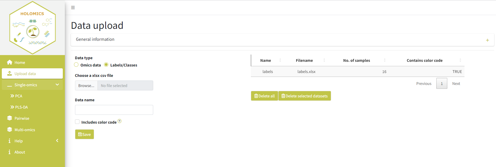
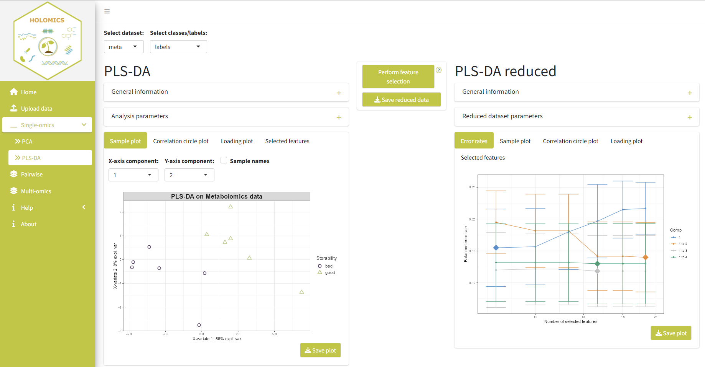

```{r, include = FALSE}
knitr::opts_chunk$set(
  collapse = TRUE,
  comment = "#>",
  echo = F,
  fig.align='center', 
  fig.pos= "h"
)
```


<style>
  :root {
    --grey: #f1f3f2;
    --green: #bfc531;
    --blue: #39B6CA;
    --orange: #e6a136;
  }  
         
  h1, h2, h3 {
    color: var(--green);
  }
  
  .list-group-item.active, .list-group-item.active:focus, .list-group-item.active:hover {
      background-color: var(--green);
  }
  .active {
    background-color: var(--green);
  }
  
  .caption{
    color: #777;
    text-align: left;
  }
</style>

 

## Introduction
<b>Holomics</b> is an R Shiny application that allows its users to perform single- and multi-omics analyses by providing a user-friendly interface to upload the different omics datasets, select and run the implemented algorithms and finally visualize the generated results. 

<b>Holomics</b> is mainly built on the R package mixOmics [@rohart2017mixomics], which offers numerous algorithms for the integrative analysis of omics datasets. From this repertoire, the single-omics algorithms "Principle Component Analysis" (PCA) and "Partial Least Squares Discriminant Analysis" (PLS-DA), the pairwise-omics analysis "sparse Partial Least Squares" (sPLS) and the multi-omics framework DIABLO ("Data Integration Analysis for Biomarker discovery using Latent variable approaches for Omics studies") have been implemented in <b>Holomics</b>.


## Getting started
### Installation
For the current Holomics version it is very important that you use R 4.2. and check that mixOmics was installed with version 6.22.0.

#### CRAN
~~~
install.packages("Holomics")
~~~

#### Github
~~~
# Install devtools if it is not already installed
install.packages("devtools")
library(devtools)

# Install Holomics package 
install_github("MolinLab/Holomics")
~~~

#### Additional packages 
You need to install the Bioconductor package separately. 

~~~
if (!require("BiocManager", quietly = TRUE))
    install.packages("BiocManager")
BiocManager::install("mixOmics")
BiocManager::install("BiocParallel")
~~~

I could be that you need to install some Bioconductor packages separately. Just use the code snippet above.

### Start application
Within the Rstudio environment, start the application either with 

~~~
library(Holomics)
run_app()
~~~

or 

~~~
Holomics::run_app()
~~~

### Data preparation
<b>Holomics</b> requires two input file types: first, the dataset(s) with the measured values of the performed omics analysis (e.g. transcriptomics, metabolomics) and second, a metadata file containing the label or class information associated to the samples.

#### Omics dataset
Omics datasets can contain molecular features measured on a continuous scale (e.g. microarray, mass spectrometry-based metabolomics) or sequenced-based count data (e.g. RNA-seq, 16S rRNA amplicon sequencing) that become continuous after pre-processing and normalisation. Generally, the omics dataset has to be a numeric matrix (basically a count table) in an .xlsx or .csv file format, where the rows have to be the samples and the columns the measured features (see Table \@ref(tab:omicsData)).
The first column has to contain the sample names and the first row the feature names. There are generally no restrictions regarding characters and symbols that are allowed in the names. It is recommended to keep the number of special characters and symbols to a minimum. Important is that all the omics datasets that belong together in the analyses have the same samples names and the same order. 
If the data contains more features/columns than excel allows, the matrix also can be uploaded in the transposed format.
Additionally, if the omics dataset contains more than 10.000 features, the dataset will be pre-filtered to 10.000 or less features as mixOmics is able to process a maximum of 10.000 features per dataset [@le2023mixomics]. 
Any wanted/necessary normalisation needs to be done for each omics dataset separately before using <b>Holomics</b>. 

Table:  (\#tab:omicsData) Example of an omics dataset with sample names in the first column and feature names in the first row.
```{r message=F}
data <- as.data.frame(readxl::read_excel("data/asv_small.xlsx", col_names = T))
rownames(data) <- data[, 1]   #all rows, first column
data <- data[,-1]
knitr::kable(data)
```


#### Metadata file
The metadate file has to be in an .xlsx or .csv file format with at least two columns (see Table \@ref(tab:labels) for an example):

* The first column contains the sample names, which have to be exactly the same and in the same order as in the associated omics datasets.

* The second column contains the classes or labels of the samples (e.g. control, treatment1, ...). The column name of the second column has to be the name of the attribute the classes describe (e.g. Quality, Treatment, ...).

* Optional: in the third column, a color code (HEX code or ASCII name) per class can be added, which will be used later in most of the plots. Here a link to an easy to use <a href="https://htmlcolorcodes.com/"> Color picker</a>.

Table:  (\#tab:labels) Example of a valid metadata file with the mandatory first two columns (sample name and label information) and the optional column with the color codes.
```{r message=F}
data <- as.data.frame(readxl::read_excel("data/labels.xlsx", col_names = T))
knitr::kable(data)
```

## Workflow overview
To make use of all the functionality provided by <b>Holomics</b>, the below described workflow should be followed. Firstly, the datasets are uploaded where an eventual pre-filtering/transformation step takes place. Afterwards, the single-omics analysis is performed, where key features are identified and the datasets are reduced accordingly. With these reduced datasets, the multi-omics analyses is applied to identify correlations between 2-n datasets. 

<br>

(ref:workflow) Visualisation of the <b>Holomics</b> workflow, which goes from uploading the input datasets to performing single-omics analyses including feature selection and finally going into the multi-omics analyses. Alternatively, it is possible to go directly into the multi-omics analyses.

```{r workflow, fig.cap = "(ref:workflow)", out.width="100%"}
knitr::include_graphics("images/workflow.png")
```
<br>
NOTE: If already  pre-filtered (ideally by <b>Holomics</b> at an earlier time) datasets are uploaded, it is possible to omit the dataset reduction route and jump directly to the multi-omics analysis step. This shortcut route can also be used, if the original datasets should go into the multi-omics analysis. For this, the "was previously filtered" checkbox needs to be activated too, to trick <b>Holomics</b>.   

## Data upload
On the data upload page the omics datasets (Figure \@ref(fig:uploadData)) and the related metadata (including sample names and labels, see Figure \@ref(fig:uploadClasses)) are uploaded. On both sub-pages, a collapsible "General information" box is given, which contains some information on how the different input files should look like. Additionally, next to some form fields question marks indicate a tooltip for a quick explanation.

### Upload an omics dataset
To upload an omics dataset (e.g. transcriptomics read count table, metabolomics table) "Omics data" as the data type should be selected. Afterwards, the respective .xlsx or .csv file has to be selected via the file upload and a file name must be entered, which will be used later in the analyses pages to identify that dataset easily. Also, it has to be checked whether the dataset was already filtered at an earlier time point (through <b>Holomics</b>) or not. If the dataset is coming from microbial community analyses (e.g. OTU/ASV table), additionally, it is important to check the "contains microbiome data" checkbox, so that a necessary pre-processing step which is basically the mixMC pipeline for microbiomics data [@le2016mixmc], is triggered. In case the dataset is transposed (samples are in columns and the features in rows) the "has transposed format" checkbox needs to be activated.

Next, the type of analysis for the dataset(s) needs to be selected. Here, the datasets can only be used for multi-omics analyses if the "was previously filtered" checkbox is checked (see also NOTE above). And, lastly, the name which should be used in the plots for the given omics dataset can be selected or manually entered. Be aware that the dataset name from before and the "plot name" here do not need to be the same and that the "plot name" can be the same for multiple datasets.

By clicking the save button, the dataset will be saved in the <b>Holomics</b> application and a summary of the uploaded information is added to the table on the right side of the page.

<br>

(ref:uploadData) Visualisation of the upload page for the omics datasets. On the left side is an example of an filled-in form with a new dataset before saving it and on the right side a summary of an already uploaded dataset is presented.

```{r uploadData, fig.cap = "(ref:uploadData)", out.width="100%"}
knitr::include_graphics("images/Upload_data.png")
```


### Upload the metadata file
To upload the metadata file with the labels or class information of each sample, "Labels/Classes" as the data type needs to be selected before uploading the respective .xlsx or .csv file. Additionally, a name for the dataset file itself must be entered. Lastly, if the metadata file also contains the optional third column with the color codes (HEX codes or ASCII names) per sample, the box "Includes color code"  needs to be activated. This customized color scheme is then used in most of the plots to depict the distinct classes. After saving, a summary of the uploaded information is added to the table on the right side of the page. Figure \@ref(fig:uploadClasses) shows on the right side the summary of an already uploaded metadata file and on the left side the form to upload a new/additional file.

<br>

(ref:uploadClasses) Visualisation of the upload page for the metadata file. On the left side the form for uploading new metadata files is given and on the right side a summary of an already uploaded is presented

```{r uploadClasses, fig.cap = "(ref:uploadClasses)", out.width="100%"}

```


## Single-omics analyses

### Principle Component Analysis
For a first glimpse into the individual omics data and for the necessary feature selection, a Principle Component Analysis (<a href="http://mixomics.org/methods/spca/">PCA</a>) can be done. This page (see Figure \@ref(fig:PCA)) is separated into two parts:

On the left side, the original, but already pre-processed and eventually pre-filtered data are depicted. On the top left of the page, the omics dataset that should be analysed is selected together with the corresponding metadata file via the drop-down menus. If the two are not compatible to each other, an error will be printed. The "General information" box shortly explains the PCA concepts and provides some links to additional knowledge sources. In the "Analysis parameters" box the number of components (a value between 2 and 15) that should be used to calculate the PCA can be chosen. Per default, the "Scaling" check box is activated and can be deactivated, if the data don't need any scaling. Below, several plots that present the PCA results using the above set parameters are given.

After triggering the feature selection process by activating the "Perform feature selection" button at the top-middle of the page, the reduced dataset is shown on the right side of the page. The number of components which are needed to get at least 80\% explained variance for the given dataset are computed. When this number is set, the algorithm determines how many features per component should be used so that the resulting model gives the best result. All the remaining features that are not being used in any component will be removed from the dataset (the original dataset will not be changed) and the reduced dataset will be used to calculate the PCA result used for the plots. The "General information" and "Reduced dataset parameters" box above the plots provide some additional information about the reduced dataset and the general feature selection process.

Additionally, the reduced dataset can be downloaded in the .xlsx file format through the  "Save reduced data" button, which will appear below the "Perform feature selection" button after the feature selection process has finished. Also, the reduced dataset will automatically be saved in the running <b>Holomics</b> application to be used later for the multi-omics analysis.

NOTE: if the feature selection process calculates that the PCA needs more than 15 components to reach the minimum of 80% of the explained variance, the feature  selection process will be aborted, as the calculation would take too long. It is then recommended to use the PLS-DA function instead. 

<br>

(ref:PCA) Visualisation of the PCA page. On the left side the original dataset can be inspected. On the right side the results are presented after the feature selection process.

```{r PCA, fig.cap = "(ref:PCA)", out.width="100%"}
knitr::include_graphics("images/PCA.png")
```

### Partial Least Squares Discriminant Analysis
The Partial Least Squares Discriminant Analysis (<a href="http://mixomics.org/methods/spls-da/">PLS-DA</a>) can also be used for single-omics datasets, but in comparison to PCA, PLS-DA is a supervised method where the information of the corresponding class (or label) is included in its computation.

On the top left of the page (Figure \@ref(fig:PLSDA)), the omics dataset that should be analysed and the corresponding metadata file are selected. If the two are not compatible, an error will be printed. The "General information" box shortly explains the concepts of the PLS-DA and provides some links to additional knowledge sources. In the "Analysis parameters" box, the number of components (a value between 2 and 15) can be adjusted and whether the dataset should be scaled (default) or not. The resulting plots are presented below. The plot output is similar to the PCA analysis, only that the PLS-DA does not provide a scree plot.

For feature selection, the "Perform feature selection" button in the middle of the page is to be clicked to start the feature selection process. The results will be presented on the right side of the page. Compared to the PCA feature selection process, the number of components that are set on the left side influences the algorithm. The algorithm tries 1 to n (number of components set) components on the provided dataset and chooses the number where the balanced error rate (BER) of the received model was the lowest. Additionally, the number of features per component is calculated and the dataset is reduced to keep only these features. The components and the scaling attribute cannot be changed for these plots.

Additionally, the reduced dataset can be downloaded in the .xlsx file format through the "Save reduced data" button, which will appear after the feature selection process has finished. Also, the reduced dataset will automatically be saved in the running <b>Holomics</b> application to be used later for the multi-omics analysis.

<br>

(ref:PLSDA) Visualisation of the PLS-DA page. On the left side the original dataset can be examined. On the right side the results after feature selection are presented. In this case, three components where calculated (number was set on the left side) and the error rates plot shows the performance of the models using the different number of components.

```{r PLSDA, fig.cap = "(ref:PLSDA)", out.width="100%"}

```

## Pairwise omics analysis
For the pairwise omics analysis (integration of two different omics datasets), the sparse Partial Least Squares (<a class='ref-link' href="http://mixomics.org/methods/spls/">sPLS</a>) method is applied. The structure of the page (Figure \@ref(fig:sPLS)) is the same as previously described in the single-omics analysis pages. On the top, the two datasets X and Y and the corresponding metadata file is selected. 

On the left side some general information about sPLS is provided and the possibility to adjust the parameters is given. Here, the user can also switch between two algorithm modes "regression" and "canonical". In mode "regression" dataset X will be used to try and predict dataset Y, so changing the datasets (X becomes Y and vice versa) leads to different results. With mode "canonical" the datasets are described to be interchangable. Thus, this mode is recommended to be used when there is no prior known dependency between the datasets. More information about the two modes is given in the <a class='ref-link' href='http://mixomics.org/methods/spls/'>mixOmics documentation</a>. <br>
Furthermore, instead of the feature selection button described in the PCA and PLS-DA chapter, there is a "Tune parameters" button in the middle of the page. The tuning process is similar to the feature selection process described in the PCA and PLS-DA chapter. It takes the by the user provided number of components and performs cross-validation to get the Q2 score per component. The tuning step determines the correlation between the actual and anticipated components by varying the amount of features chosen for each dataset. Finally, the last number of components having a total Q2 greater than 0.0975 is selected as the ideal number of components and the number of features with the highest correlation is the optimal number of features. The tuning algorithm of the sPLS tests 1 to n (number of components set on the left side) components and chooses one of these as the "ideal". After tuning, the results using the tuned parameters will be visualised on the right side of the page. Some general information and the tuned analysis parameters are provided in the boxes above the plots.

(ref:sPLS) Visualisation of the sPLS page depicting two omics datasets. On the left side, the datasets out of the single-omics analysis are used. On the right side the results of tuned datasets are presented.

<br>
```{r sPLS, fig.cap = "(ref:sPLS)", out.width="100%"}
knitr::include_graphics("images/sPLS.png")
```

## Multi-omics analysis
The multi-omics analysis is done by applying <a href="http://mixomics.org/mixdiablo/">DIABLO</a> framework of mixOmics, which can take two or more datasets as its input and tries to find any correlations between the datasets. The structure of the page (Figure \@ref(fig:DIABLO)) is the same as described in the "Pairwise omics analysis" chapter. 

On the top, the datasets are added to the "select the datasets" field and the corresponding metadata file is selected. Also here, the left side of the page some general information is provided and the possibility to adjust the analysis parameters is given in the "Analysis parameters" box. Here, the value for the design matrix can be adjusted. The design matrix indicates whether there are prior known or calculated correlations between the datasets, which should be taken into consideration. For now, <b>Holomics</b> only allows to set one correlation value over the entire matrix, which will be used for all pairwise correlations. This field is pre-filled with the lowest calculated correlation value, but can be adjusted by the user.

Again, the "Tune parameters" button in the middle of the page triggers the tuning process. This process works exactly like the one previously described for sPLS (calculates the ideal number of components and the number of features per dataset). The only difference is that here the best number of components is chosen based on the overall BER using the centroids.dist metric. For more information about the metric please have a look at the <a href="http://mixomics.org/methods/distance-metrics/">Distance Metrics</a> post on the mixOmics website. <br>
After tuning, the tuned parameters are visualised on the right side of the page. Some general information and the resulting tuned parameters are provided in the boxes above the plots.

(ref:DIABLO) Visualisation of the multi-omics page. On the left side, the datasets out of the single-omics analysis are used. On the right side the results of tuned datasets are presented.

<br>   
```{r DIABLO, fig.cap = "(ref:DIABLO)", out.width="100%"}
knitr::include_graphics("images/DIABLO.png")
```

## Help pages
The help pages that can be found in the application provide short descriptions of the used plots as well as the feature selection and tuning processes. Additionally, there are several links to the mixOmics website or to other papers, where even more detailed information is provided, if desired.

## Test datasets
Examples of transcriptomics, metabolomics and microbiomics data as well as a file with the labels and class information can be found as additional files in our paper <a href="https://bmcbioinformatics.biomedcentral.com/articles/10.1186/s12859-024-05719-4" rel="noreferrer noopener" target="_blank">Munk et.al. (2024)</a>. These omics data can be uploaded directly into the application after removing the first line with the table title in each case. In addition, exactly the same datasets were processed with Holomics in the papers' described case study.

## License
The <b>Holomics</b> package is distributed under GPL-3 (GNU GENERAL PUBLIC LICENSE version 3).

## Cite
Munk, K., Ilina, D., Ziemba, L., Brader, G. & Molin, E.M. (2024). <a href="https://bmcbioinformatics.biomedcentral.com/articles/10.1186/s12859-024-05719-4" rel="noreferrer noopener" target="_blank">Holomics - a user-friendly R shiny application for multi-omics data integration and analysis</a><br>
R package version 1.1.0 https://CRAN.R-project.org/package=Holomics

## Acknowledgements
<b>Holomics</b> has been developed at the <a href="https://www.ait.ac.at/" rel="noreferrer noopener" target="_blank">AIT Austrian Institute of Technology GmbH</a> within the research project <a href="https://metabolomics-ifa.boku.ac.at/omics40project/" rel="noreferrer noopener" target="_blank">OMICS 4.0</a>, which is funded by the Federal State of Lower Austria as part of the FTI-Strategy Lower Austria. We also would like to thank all beta testers for their valuable input and advice.

## Session info
```{r echo = FALSE}
library(Holomics)
sessionInfo()
```

## References