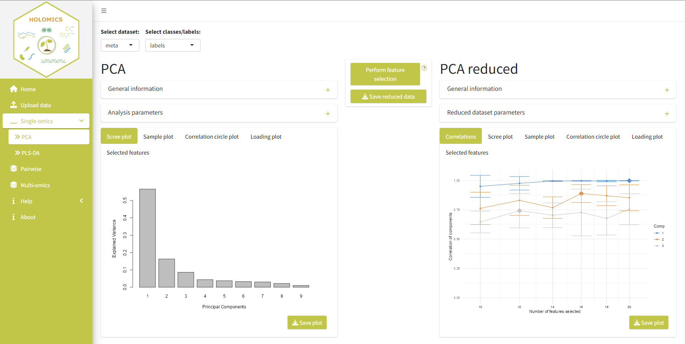

```{r, include = FALSE}
knitr::opts_chunk$set(
  collapse = TRUE,
  comment = "#>",
  echo = F,
  fig.align='center', 
  fig.pos= "h"
)
```


<style>
  :root {
    --grey: #f1f3f2;
    --green: #bfc531;
    --blue: #39B6CA;
    --orange: #e6a136;
  }  
         
  h1, h2, h3 {
    color: var(--green);
  }
  
  .list-group-item.active, .list-group-item.active:focus, .list-group-item.active:hover {
      background-color: var(--green);
  }
  .active {
    background-color: var(--green);
  }
  
  .caption{
    color: #777;
    text-align: left;
  }
</style>

 

## Introduction
<b>Holomics</b> is an R Shiny application that allows its users to perform single- and multi-omics analyses by providing a user-friendly interface to upload the different omics datasets, select and run the implemented algorithms, and finally to visualize the generated results. 

<b>Holomics</b> is mainly built on the R package mixOmics [@rohart2017mixomics], which provides numerous analysis algorithms for the integrative analysis of omics datasets. From these, the two single-omics algorithms "Principle Component Analysis" (PCA) and "Partial Least Squares Discriminant Analysis" (PLS-DA), the pairwise-omics analysis "sparse Partial Least Squares" (sPLS) and the multi-omics framework DIABLO ("Data Integration Analysis for Biomarker discovery using Latent variable approaches for Omics studies") have been implemented in <b>Holomics</b> so far.


## Getting started
### Installation
#### CRAN
~~~
install.packages("Holomics")
~~~

#### Github
~~~
# Install devtools if it is not already installed
install.packages("devtools")
library(devtools)

# Install Holomics package 
install_github("evasehr/Holomics")
~~~

### Start application
Either with 

~~~
library(Holomics)
runApp()
~~~

or 

~~~
Holomics::runApp()
~~~

### Data preparation
<b>Holomics</b> requires two input file types: first, the dataset(s) with the measured values of the performed omics analysis (e.g. transcriptomics, metabolomics) and second, a metadata file containing the label or class information associated to the samples.

#### Omics dataset
Omics datasets can contain molecular features measured on a continuous scale (e.g. microarray, mass spectrometry-based metabolomics) or sequenced-based count data (e.g. RNA-seq, 16S) that become continuous data after pre-processing and normalisation. Generally, the omics dataset has to be a numeric matrix (basically a count table) in an .xlsx or .csv file format, where the rows have to be the samples and the columns the measured features.
The first column has to contain the sample names and the first row the feature names. There are generally no restrictions regarding characters and symbols that are allowed in the names. It is recommended to keep the number of special characters and symbols to a minimum. Important is that all the omics datasets that belong together in the analyses have the same samples names. 
If the data contains more features/columns than excel allows, the matrix also can be uploaded in the transposed format.
Additionally, if the omics dataset contains more than 10.000 features, <b>Holomics</b> will pre-filter the dataset to 10.000 or less features as mixOmics is able to process a maximum of 10.000 features per dataset [@le2023mixomics]. 
Any wanted/necessary normalisation needs to be done for each omics dataset separately before using <b>Holomics</b>. An example of a valid omics dataset is given in Table \@ref(tab:omicsData).

Table:  (\#tab:omicsData) Example of a omics dataset with sample names in first column and feature names in first row.
```{r message=F}
data <- as.data.frame(readxl::read_excel("data/asv_small.xlsx", col_names = T))
rownames(data) <- data[, 1]   #all rows, first column
data <- data[,-1]
knitr::kable(data)
```


#### Metadata file
The metadate file has to be in an .xlsx or .csv file format with at least two columns:

* The first column contains the sample names, which have to be exactly the same as in the associated omics datasets. Important is also that the order of the samples is the same in all datasets!

* The second column contains the classes or labels of the samples (e.g. control, treatment1, ...). The column name of the second column has to be the name of the attribute the classes describe (e.g. Quality, Treatment, ...).

* Optional: in the third column, a color code (HEX code or ASCII name) per class can be added, which will be used later in most of the plots. Here a link to an easy to use <a href="https://htmlcolorcodes.com/" rel="noreferrer noopener" target="_blank"> Color picker</a>.

An example of a valid metadata file associated to the omics dataset in Table \@ref(tab:omicsData) is given in Table \@ref(tab:labels). 

Table:  (\#tab:labels) Example of a valid metadata file with the mandatory first two columns and the optional column with the color codes.
```{r message=F}
data <- as.data.frame(readxl::read_excel("data/labels.xlsx", col_names = T))
knitr::kable(data)
```

## Workflow overview
To make use of all the functionality provided by <b>Holomics</b>, the below described workflow should be followed. Firstly, the datasets are uploaded where an eventual pre-filtering/transformation step takes place. Afterwards, the single-omics analysis is performed, where key features are identified and the datasets are filtered accordingly. With these filtered datasets, the multi-omics analyses is applied to identify correlations between 2-n datasets. 

<br>

(ref:workflow) Visualisation of the Holomics workflow, which goes from uploading the input datasets to performing single-omics analyses and finally going into the multi-omics analyses. Alternatively, it is possible to go directly into the multi-omics analyses.

```{r workflow, fig.cap = "(ref:workflow)", out.width="100%"}
knitr::include_graphics("images/workflow.png")
```
<br>
NOTE: If already  pre-filtered (ideally by <b>Holomics</b> at an earlier time) datasets are uploaded, it is possible to jump directly to the multi-omics analysis step.

## Data upload
On the upload page the omics datasets and the related metadata (including sample names and labels) are uploaded. On both sub-pages, a collapsible "General information" box is given, which contains some information on how the different input files should look like. Additionally, next to some form fields question marks indicate a tooltip that should help to better understand the meaning of the different fields.

### Upload an omics dataset
To upload an omics dataset (e.g. transcriptomics read count table, metabolomics table, etc.) "Omics data" as the data type should be selected. Afterwards, the respective .xlsx or ..csv file has to be selected via the file upload and a file name must be entered, which will be used later in the analyses pages to identify that dataset easily. Also, it has to check whether the dataset was already filtered at an earlier time point (through <b>Holomics</b>) or not. If the dataset is coming from microbial community analyses (e.g. if it is an OTU or ASV table), additionally, it is important to check the "contains microbiome data" checkbox, so that a necessary pre-processing step especially for this kind of datasets will be triggered. If the dataset is transposed  (so the samples are columns instead of the rows and the features the rows instead of the columns) the "has transposed format" checkbox needs to be activated.

Next, the type of analysis for the dataset(s) needs to be selected. Here, the datasets can only be used for multi-omics analyses if the "was previously filtered" checkbox is checked. And, lastly, the name which should be used in the plots for the given omics dataset can be selected or manually entered. Be aware that the file name from before and the "plot name" here do not need to be the same and that the "plot name" can be the same for multiple datasets.

By clicking the save button after filling in the upload form, the dataset will be saved in the <b>Holomics</b> application and a summary of the uploaded information is added to the table on the right side of the page. Figure \@ref(fig:uploadData) shows on the right side the summary of an already uploaded dataset and on the left side the filled-in form with a new dataset before saving it.

<br>

(ref:uploadData) Visualisation of the upload page for the omics datasets. On the left side is an example of an filled-in form with a new dataset before saving it and on the right side is a summary of the already uploaded ones.

```{r uploadData, fig.cap = "(ref:uploadData)", out.width="100%"}
knitr::include_graphics("images/Upload_data.png")
```
<br>

### Upload the metadata file
To upload the metadata file with the labels or class information of each sample, "Labels/Classes" as the data type needs to be selected. Then the respective .xlsx or ..csv file has to be selected. Additionally, a name for the file itself must be entered, which will also be used to differentiate between the different uploaded files. Lastly, if the metadata file also contains a third column with the color codes (HEX codes or ASCII names) per sample the box "Includes color code"  needs to be activated. This color scheme is then used in most of the plots to depict the distinct classes.

To finalize the upload, the save button is clicked and the file is then saved in the <b>Holomics</b> application. A summary of the uploaded information is added to the table on the right side of the page. Figure \@ref(fig:uploadClasses) shows on the right side the summary of an already uploaded metadata file and on the left side the form to upload a new/additional file.

<br>

(ref:uploadClasses) Visualisation of the upload page for the metadata files. On the left side is the form for uploading new metadata files and on the right side is a summary of an already uploaded one.

```{r uploadClasses, fig.cap = "(ref:uploadClasses)", out.width="100%"}
knitr::include_graphics("images/Upload_labels.png")
```
<br>

## Single-omics analyses

### Principle Component Analysis
For a first glimpse into the individual omics data and for the necessary feature selection, a Principle Component Analysis (PCA) can be done. Figure \@ref(fig:PCA) shows the PCA page with a test dataset. This page is separated into two parts:

On the left side, the original, but pre-processed and eventually pre-filtered data are depicted. On the top left of the page, the omics dataset that should be analysed is selected together with the corresponding metadata file via the drop-down menus. If the two are not compatible to each other, an error will be printed. The "General information" box shortly explains the PCA concepts and provides some links to additional knowledge sources. In the "Analysis parameters" box the number of components (a value between 2 and 15) that should be used to calculate the PCA can be chosen. Per default, the "Scaling" check box is activated and can be deactivated, if the data don't need any scaling. Below, several plots that present the PCA results using the above set parameters are given.

On the right side, the filtered dataset is shown. To trigger the filtering process the "Filter dataset" button at the top-middle of the page is activated. The number of components which are needed to get at least 80\% explained variance for the given dataset are computed. When this number is set, the algorithm determines how many features per component should be used so that the resulting model gives the best result. All the remaining features that are not being used in any component will be removed from the dataset (the original dataset will not be changed) and the filtered dataset will be used to calculate the PCA result used for the plots. The "General information" and "Filtered dataset parameters" box above the plots provide some additional information about the filtered dataset and the general filtering process.

Additionally, the filtered dataset can be downloaded in the .xlsx file format through the  "Save filtered data" button, which will appear below the "Filter dataset" button after the filtering process has finished. Also, the filtered dataset will automatically be saved in the running <b>Holomics</b> application to be used later for the multi-omics analysis.

NOTE: if the filtering process calculates that the PCA needs more than 15 components to reach the minimum of 80% of the explained variance, the filtering process will be aborted, as the calculation would take too long. It is then recommended to use the PLS-DA function for filtering the dataset instead. 

<br>

(ref:PCA) Visualisation of the PCA page used with a metabolites dataset. On the left side the original dataset is used for the plots. Here, three components were calculated and the scree plot is opened. On the right side the filtered dataset is used and there were apparently three components necessary to achieve at least 80% explained variance, which can also be seen in the opened correlation plot.

```{r PCA, fig.cap = "(ref:PCA)", out.width="100%"}

```
<br>

### Partial Least Squares Discriminant Analysis
The Partial Least Squares Discriminant Analysis (PLS-DA) is also used to analyse single-omics datasets, but in comparison to the PCA, PLS-DA is a supervised method where the information of the corresponding class (or label) is included in its computation. In Figure \@ref(fig:PLSDA), the PLS-DA page with a test dataset is depicted.

On the top left of the page, the omics dataset that should be analysed and the corresponding metadata file are selected. If the two are not compatible, an error will be printed. The "General information" box shortly explains the concepts of the PLS-DA and provides some links to additional knowledge sources. In the "Analysis parameters" box, the number of components (a value between 2 and 15) can be adjusted and whether the dataset should be scaled (default) or not. The resulting plots are presented below. The kind of plots is similar to the ones from the PCA analysis, only that the PLS-DA does not provide a scree plot.

For feature selection, in the middle of the page, the "Filter dataset" button is to be clicked to start the filtering process. The results will be presented on the right side of the page. Compared to the PCA filtering process, the number of components that are set on the left side influences the filtering algorithm. The algorithm tries 1 to n (number of components set) components on the provided dataset and chooses the number where the BER (balanced error rate) of the received model was the lowest. Additionally, the number of features per component is calculated and the dataset is filtered to keep only these features. On the right side, the information about the result of the PLS-DA with the filtered dataset and the plots will be presented. The components and the scaling attribute cannot be changed for these plots.

Additionally, the filtered dataset can be downloaded in the .xlsx file format through the "Save filtered data" button, which will appear after the filtering process has finished. Also, the filtered dataset will automatically be saved in the running <b>Holomics</b> application to be used later for the multi-omics analysis.

<br>

(ref:PLSDA) Visualisation of the PLS-DA page used with a metabolites dataset. On the left side the original dataset is used for the plots. Here, three components were calculated and the sample plot is opened. On the right side the filtered dataset is used. For the filtering process three components where calculated (number was set on the left side) and the error rates plot shows the performance of the models using the different number of components.

```{r PLSDA, fig.cap = "(ref:PLSDA)", out.width="100%"}
knitr::include_graphics("images/PLSDA.png")
```
<br>

## Pairwise omics analysis
For the pairwise omics analysis (integration of two different omics datasets), the sparse Partial Least Squares (sPLS) method is applied. The structure of the page is the same as previously described in the single-omics analysis pages (Figure \@ref(fig:sPLS)). On the top, the two datasets and the corresponding metadata file is selected. 

On the left some general information is provided, the possibility to manipulate the analysis parameters and the resulting plots. Instead of the filter button described in the PCA and PLS-DA chapter, there is a "Tune parameters" button in the middle of the page. The tuning process is generally similar to the filtering process described in the PCA and PLS-DA chapter. It calculates the ideal number of components for the given datasets and the number of important features per dataset. "Ideal" means the number of components and features per component, where the model, which is built in the background, has the lowest error rate. Like the filtering process of the PLS-DA, the tuning algorithm of the sPLS tests 1 to n (number of components set on the left side) components and chooses one of these as the "ideal". When the tuning process has finished the results using the tuned parameters will be visualised on the right side of the page. Some general information and the resulting tuned parameters are provided in the boxes above the plots.

(ref:sPLS) Visualisation of the sPLS page used with a metabolites and transcriptomics dataset. On the left side the original datasets are used for the plots. Here, the heatmap plot is opened. On the right side the tuned datasets are used. For the tuning process three components where calculated (number was set on the left side) and also here the heatmap plot is opened and shows the effect of the tuning process.

<br>
```{r sPLS, fig.cap = "(ref:sPLS)", out.width="100%"}
knitr::include_graphics("images/sPLS.png")
```
<br>

## Multi-omics analysis
The multi-omics analysis is done by applying DIABLO framework of mixOmics, which can take two or more datasets as its input and tries to find any correlations between the datasets. The structure of the page (Figure \@ref(fig:DIABLO)) is the same as described in the "Pairwise omics analysis" chapter: 

On the top, the datasets are added and  the corresponding metadata file is selected. On the left side of the page some general information is provided and the possibility to manipulate the analysis parameters is given in the "Analysis parameters" box. Here, the value of the design matrix used by the analysis can be adjusted. The design matrix indicates whether there are prior known or calculated correlations between the datasets, which should be taken into consideration. For now, <b>Holomics</b> only allows to set one correlation value over the entire matrix, which will be used for all pairwise correlations.

The "Tune parameters" button in the middle of the page triggers the tuning process. This process works exactly like the one previously described for sPLS (calculates the ideal number of components and the number of features per dataset). The only difference is that here the best number of components is chosen based on the overall BER (balanced error rate) using the centroids.dist metric. For more information about the metric please have a look at the <a href="http://mixomics.org/methods/distance-metrics/" rel="noreferrer noopener" target="_blank">Distance Metrics</a> post on the mixOmics website. <br>
When the tuning process has finished the results using the tuned parameters will be visualised on the right side of the page. Some general information and the resulting tuned parameters are provided in the boxes above the plots.

(ref:DIABLO) Visualisation of the DIABLO page used with a metabolites, transcriptomics and microbiomics dataset. On the left side the original datasets are used for the plots. Here, the circos plot is opened, which shows the correlation between the features of the datasets. On the right side the tuned datasets are used. For the tuning process three components where calculated (number was set on the left side) and also here the ciros plot is opened and shows the effect of the tuning process.

<br>   
```{r DIABLO, fig.cap = "(ref:DIABLO)", out.width="100%"}
knitr::include_graphics("images/DIABLO.png")
```
<br>

## Help pages
The help pages that can be found in the application provide short descriptions of the used plots as well as the filtering and tuning processes. Additionally, there are several links to the mixOmics website or to multiple papers, where even more detailed information is provided, if desired.

## License
The <b>Holomics</b> package is distributed under GPL-3 (GNU GENERAL PUBLIC LICENSE version 3).

## Cite
Munk, K., Brader, G. & Molin, E.M. (2023). Holomics: an R Shiny application for the holistic integration and analysis of multiple omics data. R package version 1.0.0. https://CRAN.R-project.org/package=Holomics

## Acknowledgements
<b>Holomics</b> has been developed at the <a href="https://www.ait.ac.at/" rel="noreferrer noopener" target="_blank">AIT Austrian Institute of Technology GmbH</a> within the research project <a href="https://metabolomics-ifa.boku.ac.at/omics40project/" rel="noreferrer noopener" target="_blank">OMICS 4.0</a>, which is funded by the Federal State of Lower Austria as part of the FTI-Strategy Lower Austria. We also would like to thank all beta testers for their valuable input and advice.

## Session info
```{r, echo = FALSE}
sessionInfo()
```

## References